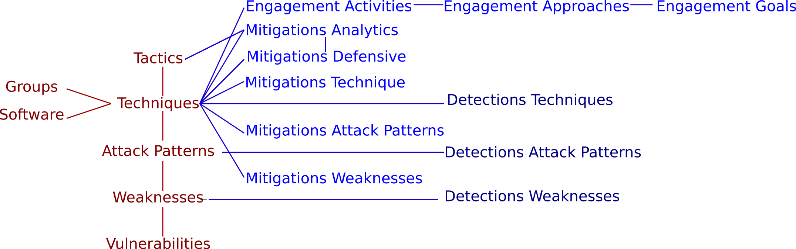

# BRON - Link and evaluate public threat and mitigation data for Cyber Hunting

[](docs/figures/BRON.png)

Threat data from [MITRE ATT&CK](https://attack.mitre.org/), [CAPEC](https://capec.mitre.org/), [CWE](https://cwe.mitre.org/) , [CVE](https://nvd.nist.gov), [MITRE Engage](https://engage.mitre.org/) and [MITRE D3FEND](https://d3fend.mitre.org/) data sources are linked together in a graph called BRON. The data types are linked with bidirectional edges. Orange nodes in figure have "offensive" information. Blue nodes in figure are "defensive" information.

Website: [bron.alfa.csail.mit.edu/info.html](http://bron.alfa.csail.mit.edu/info.html)

## Deployment
See [graph_db](graph_db) for a public instance of graph data base implementaion [bron.alfa.csail.mit.edu](http://bron.alfa.csail.mit.edu:8529)

Pre-requisites:
- Docker ([installing Docker](https://docs.docker.com/engine/install/))
- Docker Compose ([installing Compose](https://docs.docker.com/compose/install/))

To deploy BRON on top of ArangoDB, clone this repository and run:
```
docker-compose up -d
```

The deployment starts two containers:
- `brondb`: an ArangoDB server hosting the BRON graph and collections
- `bootstrap`: an ephemeral container that builds BRON and loads it into the graph database

It may take a few minutes for the bootstrap to conclude. It will download and analyze the required datasets, build BRON, and import it into the database. You can check its completion by monitoring the `bootstrap` container logs.
```
docker logs -f bootstrap
```
To access the graph database console, point your browser to `http://localhost:8529`, login, and select BRON as database. 

> Note: this deployment uses docker secrets for setting the database password; its value can be changed in `./graph_db/arango_root_password`.

## Programmatic APIs Installation

Python version > = 3.8

### Pip
- Create a `pip` environment
```
python3 -m venv bron_venv
source ./bron_venv/bin/activate
pip install -r requirements.txt
```

## Getting Started 

Build BRON on localhost (requires an arangodb installation)
```
PYTHONPATH=. python tutorials/build_bron.py --username root --password $(cat arango_root_password) --ip 127.0.0.1
tail -n 1 build_bron.log
```

This should produce a `build_bron.log` file that ends with `END building BRON`.

## Tutorials
Tutorials are available in the `tutorials` folder on the following topics:
- Using BRON in Arangodb, `tutorials/using_bron_graphdb.py`
- Building a text corpus based on BRON, `tutorials/build_bron_corpus.ipynb`

## Usage
```
usage: build_bron.py [-h] --username USERNAME --password PASSWORD --ip IP [--clean] [--clean_local_files] [--delete_mitigations] [--no_download] [--no_parsing] [--no_building] [--no_arangodb]
                     [--no_mitigations] [--no_validation]

Build BRON in Arango DB

optional arguments:
  -h, --help            show this help message and exit
  --username USERNAME   DB username
  --password PASSWORD   DB password
  --ip IP               DB IP address
  --clean               Clean all files and db
  --clean_local_files   Clean all local files
  --delete_mitigations  Clean all mitigation collections
  --no_download         Do not download data
  --no_parsing          Do not parse data
  --no_building         Do not build BRON
  --no_arangodb         Do not create and import to Arangodb
  --no_mitigations      Do not create and import mitigations
  --no_validation       Do not validate entries imported to the ArangoDb
```

## Structure of BRON
See `graph_db/schemas`

## Bibliography

arXiv report: [https://arxiv.org/abs/2010.00533](https://arxiv.org/abs/2010.00533)

```
@misc{hemberg2021linking,
      title={Linking Threat Tactics, Techniques, and Patterns with Defensive Weaknesses, Vulnerabilities and Affected Platform Configurations for Cyber Hunting}, 
      author={Erik Hemberg and Jonathan Kelly and Michal Shlapentokh-Rothman and Bryn Reinstadler and Katherine Xu and Nick Rutar and Una-May O'Reilly},
      year={2021},
      eprint={2010.00533},
      archivePrefix={arXiv},
      primaryClass={cs.CR}
}
```